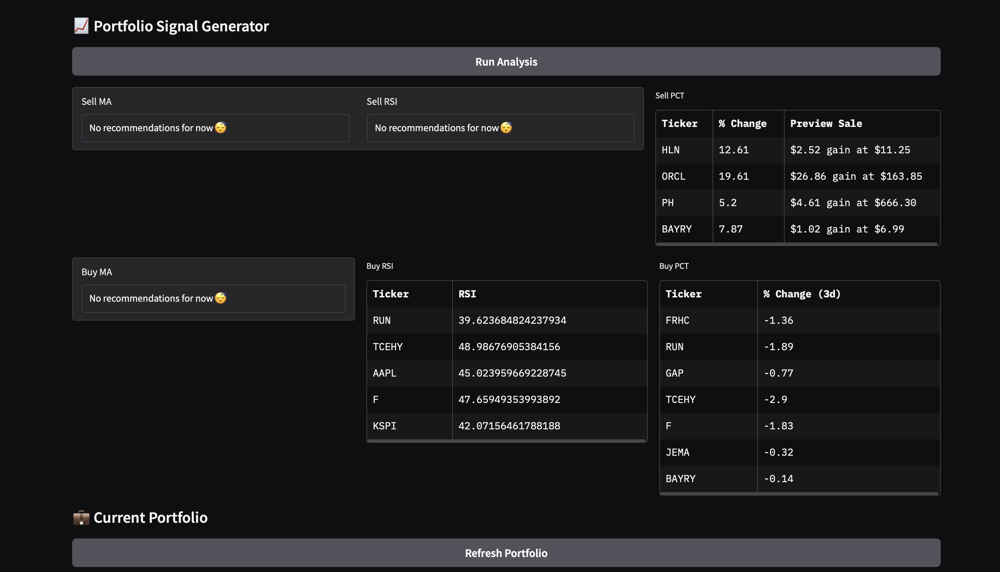

# 📈 Portfolio Signal Generator

Lightweight Gradio app for portfolio monitoring and trade logging using live Yahoo Finance data.  
Generates **buy/sell signals** from technical indicators and tracks **realized P&L** in a local SQLite database.

---

## 🔢 Metrics & Signals

- **RSI (14-day)** — via `ta.momentum.RSIIndicator`
  - **Sell** signal when **RSI > 70**
  - **Buy** screen when **RSI < 50**
- **Moving-Average Crossover** — **20/50** SMA
  - **Buy** when 20 crosses **above** 50 (golden cross)
  - **Sell** when 20 crosses **below** 50 (death cross)
- **% Change Screens**
  - **Sell** preview when position gain **≥ 5%** vs. cost basis
  - **Buy** screen when **3-day return < 0%**
- **Realized Profit (FIFO)**  
  - Computes realized P&L over a date range using **first-in, first-out** lot matching from logged trades.

---

## 🧰 Tools / Stack

- **[Gradio]** UI for running screens & manual trades
- **[yfinance]** market data (Yahoo Finance)
- **[pandas]** data wrangling
- **[ta]** technical indicators
- **SQLite** (`trades.db`) for trades & portfolio
- Python stdlib: `datetime`, `sqlite3`, `collections`, etc.

> Minimal install: `pip install gradio yfinance pandas ta`

---

## 🧪 What You Can Do (Functions)

- **Data & Signals**
  - `fetch_market_data(tickers, lookback_days)` — pull OHLCV via yfinance
  - `get_rsi(data, ticker)` — latest price & RSI
  - `get_ma_signals(data, ticker)` — 20/50 MA crossover signal
  - `analyze_*` — run full screens:
    - `analyze_sell_ma`, `analyze_sell_rsi`, `analyze_sell_pct`
    - `analyze_buy_ma`, `analyze_buy_rsi`, `analyze_buy_pct`
- **Trades & Portfolio**
  - `init_db()` — set up `trades` / `portfolio` tables
  - `log_trade(type, ticker, qty, price)` — append a BUY/SELL
  - `buy_stock(...)`, `sell_stock(...)` — update portfolio + log trades
  - `view_all_trades()` — DataFrame of all trades
  - `remove_exact_duplicates()` — de-dup identical trade rows
  - `remove_all_sell_trades()` — purge SELLs (utility)
  - `calculate_realized_profits(start, end)` — FIFO realized P&L by ticker
  - `get_portfolio()` — current portfolio snapshot (from DB)
- **UI**
  - `run_analysis()` — triggers all screens and displays results in Gradio

